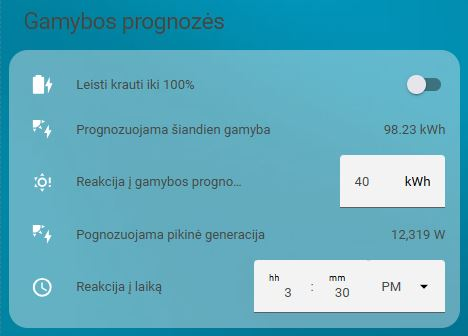

# Home Assistant – Solis baterijų krovimo automatikos ir kortelės (LT/EN)

<a href="https://buymeacoffee.com/omenukas">
  
</a>


🟡 **Ši versija – lietuvių kalba.**  
🔵 [English version](https://omenukas.github.io/battery-charging-models-for-Solis-inverters/) ·
[Svetainė](https://omenukas.github.io/battery-charging-models-for-Solis-inverters/)

**ATNAUJINTA (2025-12-28)**. Visi reikalingi sensoriai ir automatizacijos sudėtos į vieną packages yaml failą. 
Atsisiųskite [03_charging_vasara_ziema.yaml](packages/03_charging_vasara_ziema.yaml), įdėkite šį failą į aplanką `config/packages/`.
`configuration.yaml`, jeigu dar neturite, įrašykite:
```
homeassistant:
  packages: !include_dir_named packages
```
Restartuoti Home Assistant.
Bus sukurti visi reikalingi sensoriai ir automatizacijos.

**ATNAUJINTA (2025-09-21)**. Automatizacijose tikrinama ar inverteryje įjungtas baterijų rezervavimas (Battery Reserve) ir skriptų pabaigoje grąžina į buvusią padėtį. Taip pat pakoreguota kasdieninė baterijų krovimo logika.

## Apžvalga

Šiame repozitoriume pateikiu keletą automatizacijų, kurios galėtų padėti valdyti ir prižiūrėti, kaupiklius, prijungtus prie Jūsų Solis įtampos keitiklio. Galima automatizacijas pritaikyti ir kitų gamintojų įtampos keitikliams, parenkant tinkamus sensorius, tačiau šis projektas paruoštas, naudojant [Solis modbus](https://github.com/Pho3niX90/solis_modbus) integraciją. Kadangi naudoju Waveshare modbus keitiklį, tai Solis integracijoje sensoriai turi atitinkamus pavadinimus, kuriuos automatizacijose jums gali reikėti pakoreguoti pagal savo sensorių atitinkamus pavadinimus.
Mano Solis dashboard'as atrodo taip:
 


Home Assistant **automatizacijos** ir **Lovelace kortelės** pateikiamos dviem kalbomis: **lietuviškai (LT)** ir **angliškai (EN)**. LT yra numatytoji; kiekviename kataloge yra atitikmuo EN.

## Struktūra
```
automations/
  ├─ lt/  # lietuviškos automatikos (YAML)
  └─ en/  # angliškos automatikos (YAML)
cards/
  ├─ lt/  # lietuviškos Lovelace kortelės (YAML)
  └─ en/  # angliškos Lovelace kortelės (YAML)
helpers/
  ├─ lt/helpers_lt.yaml  # LT helperių aprašymai su ikonėlėmis
  └─ en/helpers_en.yaml  # EN helperių aprašymai su ikonėlėmis
```

## Kaip naudoti
1. **Helperiai**
   Automatizacijose ir kortelėse naudojama visa eilė helper tipo subjektų (entity). Todėl pradžioje reikia sukurti visus reikalingus helper'ius. **SVARBU** naudoti tos pačios kalbos automatizacijas, korteles ir helper'ius - Visi komponentai turi būti arba tik angliški arba tik lietuviški.
   - YAML naudotojams: įtraukite `helpers/lt/helpers_lt.yaml` **arba** `helpers/en/helpers_en.yaml` į `configuration.yaml`.
   - Jei helperius kūrėte per UI, tai šiuos failus naudokite kaip pavyzdį pavadinimams/ikonėlėms. Nepamirškite patikrinti ar susikūrė tiksliai toks Entity ID.

2. **Automatikos**  
   - Automatizacijų failai pritaikyti copy/paste į naują UI automatizacijos skriptą:
Sukurti naują automatizaciją - Settings->Automations&Scenes->+Create automation->pasirenkama "Create new automation"->dešiniame viršutiniame kampe paspausti ant 3 taškų->pasirinkti "Edit in YAML"-> atsidariusiame lange išvalyti, kad neliktų jokio įrašo ir įklijuoti pasirnkto automatizacijos .yaml failo turinį ->Save.
Taip pat .yaml turinį galite įdėti tiesiai į `config/automations/` (reikės pakoreguoti skripto sintaksę) ir **perkraukite automatikas**.

## Automatikų paaiškinimai
**Akumuliatorių įkrovimas nuo saulės – dienos logika**
> [!IMPORTANT]
> **PASTABA:** ši automatizacija aktuali tiems, kurių saulės elektrinės momentinė generacija viršyja elektros tinklų (ESO) išduotas sąlygas, turi fiksuotus elektros tiekimo planus ir net-metering apskaitos planą. Net-billing, planų pagal biržos kainas ir norint prisidėti prie tinklų balansavimo, reikalingos kitos automatizacijos, prie kurių galimai ateityje irgi prieisiu.



Šiam scriptui reikalinga papildoma [Solcast_forecast](https://github.com/david-rapan/ha-solcast)  integracija į Home Assistant. 
Iš šios integracijos bus naudojama pora sensorių einamos dienos prognozuojamai gamybai ir maksimaliai generacijai įvertinti.
Paskirtis - įvertinti ar numatoma pakankama elektos gamyba iš saulės ir pagal tai suplanuoti, kada bus kraunamos baterijos, kad nakčiai jos būtų pilnai įkrautos.
Kaip tai veikia:
- žinodami savo dienos elektros poreikį ir baterijų talpą, galite numatyti, koks reikalingas energijos kiekis, kad dienos metu būtų patenkinami momentinio elektros suvartojimo poreikiai ir, kad įkrauti iki 100% baterijas. Ši reikšmė įrašoma kortelėje į `Reakcija į gamybos prognozę`. Jeigu prognozė yra mažesnė, nei jūsų užduota, tai inverteris visą dieną dirbs "Self use" režimu, taip suteikdamas pirmenybę baterijų įkrovimui.
- Tuo atveju, jeigu prognozuojama gamyba yra didesnė, nei jūsų užduota, tikrinama ar numatomas generacijos pikas yra didesnis, nei jūsų užduotas `Reakcija į max generaciją`. Jeigu prognozė didesnė, nei jūsų užduota - inverteris persijungia į "Selling first" režimą, taip suteikdamas pirmenybę atiduoti pagamintą elektros energiją į tinklą. Jeigu ši prognozė yra mažesnė, nei jūsų užduota reikšmė, tai tikrinama ar baterijose yra pakankamas likutis (nustatytas baterijos backup rezervas + 10%)ir , jeigu jis nepakankamas, tai inverteris lieka dirbti "Self use" režimu, kol pasieks pakankamą įkrovą. Jeigu įkrova yra pakankama ir laikas yra iki vidurdienio, tai inverteris perjungiamas į "Selling first" režimą.
- Kodėl tokia logika: Elektros tinklai nustato leidžiamą generuoti į tinklą galią, ir ją pasiekus, reikia riboti arba gamybą arba perteklių atiduoti baterijų įkrovimui. Todėl į lauką `Reakcija į max generaciją` patartina įrašyti šiek tiek mažesnę reikšmę, nei jums ESO išdavė sąlygose leistiną generuoti (dėl prognozių paklaidos) ir pradžioje baterijos nebus kraunamos, kad jeigu vis viršijama leistina gamybą, tai tą perviršį panaudos baterijų įkrovimui. 
- `Reakcija į laiką` - įrašote laiką, kada akumuliatoriai turi būti jau pilnai įkrauti. Jeigu inverteris dirbs "Selling first" režimu, tai bus perjungtas į "Self use", kad pilnai įkrauti baterijas, jei iki to laiko dar nebuvo tai padaryta.
 Padariau rankinį laiko pasirinkimą, nes nesugalvojau, kaip tą galima būtų automatizuoti, įvertinant metų laikus (kada pradeda saulė leisti), kitus galimus faktorius.

Atsisiųsti kortelę - [Akumuliatorių krovimo nuo saulės kortelė](cards/lt/lt_generation_forecasts.yaml) 
     
Atsisiųsti automatizacijos skriptą - [Akumuliatorių krovimo nuo saulės skriptas](automations/lt/lt_solar_daytime_charging.yaml) 

**Elektros planiniai atjungimai (ESO planiniai darbai)**


Bent jau mano praktikoje, kai elektros tinklai numato elektros atjungimus, tai jie beveik visada būna nuo ryto, kai akumuliatoriai būna išsikrovę po nakties, bet saulės elektrinė dar tik pradeda gamybą. Todėl, gavus iš elektros tinklų pranešimą apie numatomą elektros atjungimą, galima iš anksto pasirūpinti, kad tą dieną, kai bus atjungiama elektra, akumuliatoriai būtų pilnai įkrauti. 
Tam reikalinga papildoma lokalaus Home Assistant kalendoriaus integracija. Reikia sukurti naują kalendorių `calendar.eso_planiniai_darbai`:
Home Assistant->Settings->Devices&Services->+Add integration->per paiešką surandame ir pasirenkame "Local calendar"->atsidariusioje lentelėje "Calendar name" įrašome **BŪTINAI** `eso planiniai darbai`ir pažymime "Create an empty calendar"->spaudžiame "Submit" ir "Finnish". Susikūrė naujas kalendorius į kurį bus registruojami elektros tinklų planiniai darbai. Dar kartą pasitikrinkite ar tikrai susikūrė kalendorius, kurio entity `calendar.eso_planiniai_darbai`.
Kaip tai veikia:
   - Gavus pranešimą iš elektros tinklų, į "ESO planiniai darbai" kortelę įrašome darbu pradžios ir pabaigos datą ir laiką. Paspaudus mygtuką "Sukurti ESO įvykį", kalendoriuje tai dienai sukuriamas įvykis.
   - Automatizacija, vidurnaktį aptikusi, kad tą dieną numatomas elektros atjungimas, pradeda vykdyti tokį scenarijų:
   - inverteryje įjungia `switch.grid_time_of_use_charging_period_1`- įjungia priverstinį baterijų krovimą iš tinklo. Šį TOU inverteryje reikėtų turėti iš anksto pasiruoštą. Jeigu jis jau naudojamas kitur, tai pasirinkti kitą laisvą ir nepamiršti padaryti pataisymus automatizacijose. Kadangi pas mane baterijos aukštos įtampos, tai mano nustatymai tokie:
     Charge Time Slot 1 - 00:00-06:00;
     Charge Current 1 - 20A
     SOC1 - 100%
     Šiuos nustatymus galima padaryti tiek SolisCloud programėlėje, tiek HA Solis modbus integracijoje.
   - įjungia `input_boolean.akumuliatoriu_rankinis_rezervavimas`- Home Assistant virtualus jungiklis, kurį sukūrėte Helper dalyje. Reikalinga, kad atjungti kitas galbūt tuo metu naudojamas automatizacijas.
   - inverteryje įjungia `switch.reserve_battery_mode`, jeigu jis nebuvo įjungtas. Prieš tai įsimenama jo būsena.
   - įsimena esamą `number.solis_waveshare_backup_soc`- įsimena, koks inverteryje šiuo metu nustatytas baterijų backup rezervavimas, kad vėliau žinotų kokias reikšmes atstatyti
   - `number.solis_waveshare_backup_soc` reikšmę nustato į "100" - nustato baterijų rezervavimą į "100%", kad neleistų akumuliatoriams išsikraudinėti, kol nedingo elektros tiekimas iš tinklų;
   - Prasideda baterijų krovimas iš tinklo. Pasiekus akumuliatorių 100% įkrovą, išjungiamas inverteryje `switch.grid_time_of_use_charging_period_1`, tačiau baterijos rezervavimas lieka įjungtas ir rezervas nustatytas 100%. Tokiu būdu ryte akumuliatoriai bus pilnai įkrauti, o automatizacija lauks kol dings įtampa bent vienoje į įvadinių fazių arba ateis laikas, kuris kalendoriuje pažymėtas, kaip darbų pabaiga. Išpildžius bent vieną iš sąlygų, automatizacija grąžins visus inverterio nustatymus į pradinę būseną, Home Assistant vėl pradės veikti "Žiemos režimas" (aprašytas žemiau), jei jis buvo įjungtas.

Atsisiųsti kortelę - [ESO planiniai darbai kortelė](cards/lt/lt_grid_planned_outages.yaml) 
     
Atsisiųsti automatizacijos skriptą - [ESO planiniai darbai skriptas](automations/lt/lt_grid_planned_outage_prep_restore.yaml) 

Atsisiųsti įvykio kalendoriuje sukūrimo skriptą - [ESO įvykio sukūrimo skriptas](automations/lt/lt_grid_create_event_from_card.yaml) 

**Žiemos režimas**  


Žiemą, kai nėra elektros gamybos iš saulės, veikia šilumos siurbliai, akumuliatoriai tampa beveik nereikalingi. Tačiau jie vis dar gali atlikti savo pagrindinę funkciją - užtikrinti elektros tiekimą į namus, kai dingsta elektros tiekimas iš tinklų.
Ką daro ši automatizacija:
   - Kortelėje įjungus `Žiemos režimas`, įjungiamas inverteryje baterijų backup rezervavimas ir "Self use" režimas (jeigu dar nebuvo įjungti) ir nustatomas rezervo SOC toks, kokia reikšmė yra jūsų pačių pasirinkta laukelyje `Rezervas žiemai`. Tai reiškia, kad žiemos režimo metu ir kol yra elektros tiekimas iš tinklų, jūsų inverterio akumuliatoriai niekada neišsikraus žemiau užduotos ribos.
   - Išjungus žiemos režimą, bus atsatytas baterijų rezervavimas į būseną, kuri buvo prieš žiemos režimą, ir baterijų backup rezervas nustatomas į tokią reikšmę, kokia reikšmė yra jūsų pačių pasirinkta laukelyje `Rezervas vasarai`. 
   - Ši automatizacija turi dar vieną saugiklį - jos vykdymas nutraukiamas, jeigu įjungiamas `input_boolean.akumuliatoriu_rankinis_rezervavimas`. Šį jungiklį junginėja kitos su akumuliatorių krovimu susijusios automatizacijos, kad įgautų prioritetą.

Atsisiųsti kortelę - [Žiemos režimo kortelė](cards/lt/lt_winter_mode_reserves.yaml) 
     
Atsisiųsti automatizacijos skriptą - [Žiemos režimo skriptas](automations/lt/lt_winter_mode_reserve.yaml) 


**Akumuliatorių profilaktinis įkrovimas**


Kadangi žiemą akumuliatoriai nuo saulės turi mažai šansų įsikrauti iki 100% ir ilgesniam laiko periodui tai turi įtaką pačių baterijų degradacijai, tai ši automatizacija pasirūpina, kad kartais baterijos būtų pilnai ikraunamos.
Ši automatizacija veikia tik tada, kai yra įjungtas "Žiemos režimas" 
Kortelėje galite nustatyti profilaktinio įkrovimo periodiškumą ir laiką, kada prasidės priverstinis krovimas iš tinklo.
Ši automatizacija inverteryje įjungia `switch.grid_time_of_use_charging_period_2`- priverstinį baterijų krovimą iš tinklo. Šį TOU inverteryje reikėtų turėti iš anksto pasiruoštą. Jeigu jis jau naudojamas kitur, tai pasirinkti kitą laisvą ir nepamiršti padaryti pataisymus automatizacijose.
Mano inverteryje nustatyta taip:
     Charge Time Slot 2 - 00:00-00:00;
     Charge Current 2 - 20A
     SOC2 - 100%

Atsisiųsti kortelę - [Akumuliatorių profilaktinio krovimo kortelė](cards/lt/lt_preventive_battery_charging.yaml) 
     
Atsisiųsti automatizacijos skriptą - [Akumuliatorių profilaktinio krovimo skriptas](automations/lt/lt_solar_periodic_charging.yaml) 

## Pabaigai

Esu dar jaunas naudotojas hibridinės sistemos, todėl tikrai yra dar ką tobulinti ir galimai ne viską įvertinau. Todėl pastabos, komentarai priimami ir, kiek leis laikas ir galimybės bandysiu tobulinti šias automatizacijas.


Jeigu patiko mano darbas, visada galite tai įvertinti 

<a href="https://buymeacoffee.com/omenukas">
  
</a>

<div align="center">
  <a href="https://github.com/omenukas/battery-charging-models-for-Solis-inverters">
    
  </a>
  &nbsp;
  <a href="https://github.com/omenukas/battery-charging-models-for-Solis-inverters/archive/refs/heads/main.zip">
    
  </a>
</div>

<p align="center">
  <a href="https://github.com/omenukas/battery-charging-models-for-Solis-inverters/blob/main/README.lt.md"
     style="display:inline-block;padding:10px 16px;border:1px solid #0366d6;border-radius:6px;text-decoration:none;">
    Eiti į GitHub repo →
  </a>
</p>
