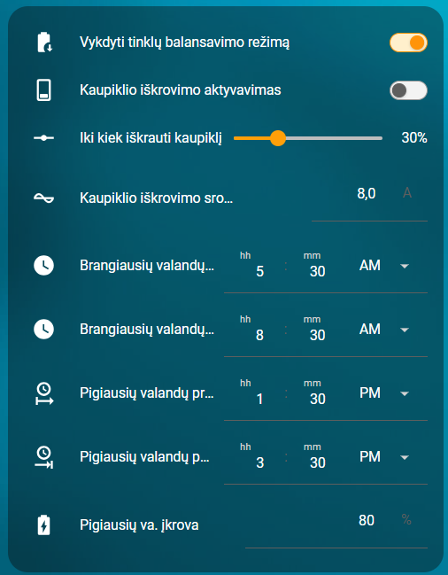

# Home Assistant – Solis baterijų krovimo automatikos ir kortelės

<a href="https://buymeacoffee.com/omenukas">
  
</a>


[Svetainė](https://omenukas.github.io/battery-charging-models-for-Solis-inverters/)

**ATNAUJINTA (2026-05-28)**. Pridėta papildoma automatizacija baterijų iškrovimui brangiausiomis rytinėmis valandomis ir įkrovimas pigiausiomis valandomis pagal NordPool. Home Assistant reikia atnaujinti [03_charging_vasara_ziema.yaml](packages/03_charging_vasara_ziema.yaml) ir [Akumuliatorių krovimo nuo saulės kortelė](cards/lt/lt_generation_forecasts.yaml). Taip pat į packages direktoriją įdėti naują [04_charging_iskrovimas.yaml](packages/04_charging_iskrovimas.yaml) bei reikalinga nauja kortelė [Tinklo balansavimo kortelė](cards/lt/lt_grid_balancing_card.yaml).
Šiai versijai reikalinga Home Assistant įdiegti [NordPool](https://www.home-assistant.io/integrations/nordpool/) integraciją.

**ATNAUJINTA (2026-05-02)**. Pakeista baterijos krovimo logika vasaros režimu. Taip pat pakoreguota akumuliatorių krovimo, kai baigiasi ESO sukauptos kWh, automatizacija.
Pakoreguoti šių automatizacijų aprašymai pagal naują logiką. Home Assistant eikia atnaujinti [03_charging_vasara_ziema.yaml](packages/03_charging_vasara_ziema.yaml) ir [01_charging_eso.yaml](packages/01_charging_eso.yaml).

**ATNAUJINTA (2026-03-13)**. Visi reikalingi sensoriai ir automatizacijos sudėtos į du packages yaml failus. 
Atsisiųskite [03_charging_vasara_ziema.yaml](packages/03_charging_vasara_ziema.yaml) ir [01_charging_eso.yaml](packages/01_charging_eso.yaml), įdėkite šiuos failus į aplanką `config/packages/`.
`configuration.yaml`, jeigu dar neturite, įrašykite:
```
homeassistant:
  packages: !include_dir_named packages
```
Restartuoti Home Assistant.
Bus sukurti visi reikalingi sensoriai ir automatizacijos.

Taip pat pridėta nauja automatizacija ir kortelė, tam atvejui, kai pasibaigia žiemą sukauptos pasaugojime kilovatvalandės ir turite ESO dviejų tarifų (dieninis/naktinis) planą.

**ATNAUJINTA (2025-09-21)**. Automatizacijose tikrinama ar inverteryje įjungtas baterijų rezervavimas (Battery Reserve) ir skriptų pabaigoje grąžina į buvusią padėtį. Taip pat pakoreguota kasdieninė baterijų krovimo logika.

## Apžvalga

Šiame repozitoriume pateikiu keletą automatizacijų, kurios galėtų padėti valdyti ir prižiūrėti, kaupiklius, prijungtus prie Jūsų Solis įtampos keitiklio. Galima automatizacijas pritaikyti ir kitų gamintojų įtampos keitikliams, parenkant tinkamus sensorius, tačiau šis projektas paruoštas, naudojant [Solis modbus](https://github.com/Pho3niX90/solis_modbus) integraciją. Kadangi naudoju Waveshare modbus keitiklį, tai Solis integracijoje sensoriai turi atitinkamus pavadinimus, kuriuos automatizacijose jums gali reikėti pakoreguoti pagal savo sensorių atitinkamus pavadinimus.
Mano Solis dashboard'as atrodo taip:
 


## Struktūra
```
packages/
  ├─   # pilnas sensorių ir automatikų komplektas (YAML)
cards/
  ├─ lt/  # lietuviškos Lovelace kortelės (YAML)

```


## Automatikų paaiškinimai
**Akumuliatorių įkrovimas nuo saulės – dienos logika**
> [!IMPORTANT]
> **PASTABA:** ši automatizacija aktuali tiems, kurių saulės elektrinės momentinė generacija viršyja elektros tinklų (ESO) išduotas sąlygas, turi fiksuotus elektros tiekimo planus ir net-metering apskaitos planą. Net-billing, planų pagal biržos kainas ir norint prisidėti prie tinklų balansavimo, reikalingos kitos automatizacijos, prie kurių galimai ateityje irgi prieisiu.


Kortelės parametrų reikšmės:
- `Leisti krauti iki 100% (90/100)` - paprastomis dienomis baterija kraunama iki 90%, o įjungus šį jungiklį, kraunama iki 100%.
- `Prognozuojama šiandien gamyba` - Solcast gamybos prognozė šiai dienai. Prognozė tikrinama kas 30min. ir ji dienos bėgyje gali kisti. Automatizacijos atsižvelgia į pokyčius.
- `Reakcija į gamybos prognozę` - atsižvelgiant į jūsų elektrinės, kaupiklio dydį, namo poreikius, įrašote kiek preliminariai kWh reikėtų, kad patenkinti visus namo ir kaupiklių dienos poreikius.
- `Rytinė reikalinga įkrova` - įrašote kokią reikėtų palaikyti minimalią baterijos įkrovą. Jeigu ryte baterijos įkrova bus mažesnė, nei nustatyta šiame parametre, tai inverteris pirmiausia kraus bateriją ir tik pasiekus šią reikšmę, toliau vykdys automatizacijas.
- `Kaupiklio talpa` - kokios talpos kaupiklis prijungtas prie inverterio.
- `Liko įkrauti (tik kaupiklis)` - stebėjimui, kiek kWh trūksta iki kaupiklio pilno įkrovimo.
- `Liko įkrauti (su namų vartojimu)` - stebėjimui, kiek kWh trūksta, kad pilnai įkrauti kaupiklį ir namo poreikiams patenkinti.
- `Liko prognazuojamos gamybos šiandien` - stebėjimui, kiek, pagal Solcast prognozę, dar bus šiandien pagaminta kWh.
- `Papildoma namų vartojimo rezervacija` - jeigu namo vartojimas didesnis, nei rezervuota automatizacijoje, tai čia galima pridėti dar papildomą namo poreikį.

Šiam scriptui reikalinga papildoma [Solcast_forecast](https://github.com/david-rapan/ha-solcast)  integracija į Home Assistant. 
Iš šios integracijos bus naudojama pora sensorių einamos dienos prognozuojamai gamybai ir maksimaliai generacijai įvertinti.
Paskirtis - įvertinti ar numatoma pakankama elektos gamyba iš saulės ir pagal tai suplanuoti, kada bus kraunamos baterijos, kad nakčiai jos būtų pilnai įkrautos.
Kaip tai veikia:
- žinodami savo dienos elektros poreikį ir baterijų talpą, galite numatyti, koks reikalingas energijos kiekis, kad dienos metu būtų patenkinami momentinio elektros suvartojimo poreikiai ir, kad įkrauti iki 100% baterijas. Ši reikšmė įrašoma kortelėje į `Reakcija į gamybos prognozę`. Jeigu prognozė yra mažesnė, nei jūsų užduota, tai inverteris visą dieną dirbs "Self use" režimu, taip suteikdamas pirmenybę baterijų įkrovimui.
- Kortelėje `Gamybos prognozė` įrašome kokia yra `Kaupiklio talpa`, kokia reikalinga minimali kaupiklio įkrova `Reikalinga rytinė įkrova`
- Taip pat galima įrašyti `Papildoma namų vartojimo rezervacija`. Reikšmę paaiškinsiu žemiau.
- Ryte 5:00 pradžioje tikrinama ar baterijos įkrautos ne mažiau nei jūsų užduota minimali baterijos įkrova `Reikalinga rytinė įkrova`. Jeigu mažiau - inverteryje nustatomas "Self Use" režimas, kol baterijos įkrovos lygis pasieks numatytą reikšmę. Tada pradedama tikrinti prognozė, kurios duomenis atnaujina kas puse valandos ir pagal tai koreguoja inverterio režimą. Automatizacija mato kokia yra dabartinė baterijos įkrova ir, žinodama kaupiklio talpą, paskaičiuoja kiek kWh trūksta iki pilnos įkrovos. Šią reikšmę daugina iš 1.5 koeficiento, taip pridedant dar momentinį namo vartojimą (50% kaupiklio trūkstamų kWh). Taip pat pridedama reikšmė, įrašyta į `Papildoma namų vartojimo rezervacija`. Šią reikšmę įdėjau, jeigu pastebėsite, kad iki vakaro nespėja įkrauti pilnai kaupiklio, tai didinant šią reikšmę paankstinamas pilnas įkrovimas prieš generacijos pabaigą. Apibendrinant dienos kWh poreikis paskaičiuojamas - Trūkstamos kWh kaupikliui iki pilno įkrovimo + 50% tos kaupiklio talpos + `Papildoma namų vartojimo rezervacija`. Gautą reikšmę lygina su prognoze kiek dar liko šiandien gamybos ( `Liko prognazuojamos gamybos šiandien`). Jeigu prognozė didesnė, nei visas namo ir kaupiklio poreikis, tai inverteryje jungiamas "Feed In Priority" režimas. Jeigu prognozės ir poreikio reikšmės susivienodina, tai inverteris perjungiamas į "Self use" režimą.
- Standartiškai baterija įkraunama iki 90% (baterijų saugojimo tikslais) ir kiekvieno mėnesio 15d. aktyvuojamas baterijos krovimas iki 100%. Po trijų dienų vėl grįžtama prie 90% įkrovos režimo. Tai padaryta tam, kad kartą į mėnesį baterijų celės galėtų susikalibruoti. Kai baterijos įkrova pasiekia 90%, tai nesvarbu kokia prognozė, inverteris persijungia į "Feed in priority"
- Šios automatizacijos kortelėje įvestas papildomas jungiklis, kurį įjungus, visada bus kraunama iki 100%, o išjungus, bus kraunama iki 90% ir mėnesio 15 dieną trims paroms aktyvuojamas krovimas iki 100%.


Atsisiųsti kortelę - [Akumuliatorių krovimo nuo saulės kortelė](cards/lt/lt_generation_forecasts.yaml) 


**Kaupiklio iškrovimas/įkrovimas pagal NordPool**



Kortelės parametrų reikšmės:
- `Vykdyti tinklų balansavimo režimą` - įjungus bus vykdoma automatizacija, kai pagal NordPool kainas vykdomas baterijų iškrovimas ir įkrovimas.
- `Kaupiklio iškrovimo aktyvavimas` - stebėjimui ar vykdomas šiuo metu baterijos iškrovimas į tinklą.
- `Ribinė NP kaina` - čia galite įvesti ribinę elektros kainą. Jeigu NordPool kaina dienos metu nesieks šios jūsų nustatytos ribos, tai nebus vykdomas baterijų įškrovimas į tinklą ir bus vykdoma paprasta dienos logika.
- `Iki kiek iškrauti kaupiklį` - pasirenkate iki kiek iškrauti kaupiklį, kai bus vykdomas baterijos iškrovimas į tinklą.
- `Kaupiklio iškrovimo srovė` - pasirenkate kokia srove bus iškraunamas kaupiklis į tinklą.
- `Brangiausių valandų pradžia` ir `Brangiausių valandų ppabaiga` - tai trijų valandų laiko tarpas, kada pagal NordPool bus didžiausios elektros kainos (tikrinama tik pirma dienos pusė, nes antroje dienos pusėje prioritetas paruošti kaupiklį vakarui).
- `Pigiausių valandų pradžia` ir `Pigiausių valandų pabaiga` - tai dviejų valandų laiko tarpas, kada pagal NordPool bus mažiausios elektros kainos ir tada prioritetas pagamintą elektrą skirti baterijos įkrovimui.
- `Pigiausių va. įkrova` - nustatykite iki kiek procentų krauti bateriją pigiausiomis valandomis. Rekomenduoju nesirinkti 100%, nes tokiu atveju, pasibaigus pigiausioms valandoms ir, jeigu buvo gamybos perviršis, tai nebus kur jo padėti ir tiesiog prarasite dalį kWh.

5:00, kai pradedama vykdyti dienos logikos automatizacija, dar yra tikrinama ar įjungtas `Vykdyti balansavimo režimą` jungiklis. Jeigu jis yra įjungtas, tai pradedama vykdyti papildoma automatizacijos atšaka.
Pagal NordPool tos dienos duomenis, ieško rytinių 3 brangiausių valandų. Atėjus tam laikui, įjungiamas baterijų iškrovimo į tinklą, režimas. Kortelėje galite nustatyti kokia srove bus vykdomas iškrovimas. Pasibaigus brangiausių valandų laikui arba baterijai pasiekus `iki kiek iškrauti kaupiklį` reikšmę, išjungiamas iškrovimo režimas ir ieškoma tos dienos pigiausiu dviejų valandų. Iki to laiko inverteris veikia "Feed in priority" režimu ir kas pusvalandį tikrina prognozes, kaip tai aprašyta dienos logikoje. Atėjus pigiausių valandų laikui, perjungiama į "Self use" režimą kol praeis tos 2 valandos arba bus pasiekta įkrova nustatyta kortelėje `Pigiausių valandų įkrova`. Tada grįžtama prie dienos logikos.
Visa ši automatizacijos atšaka nevykdoma, jeigu dienos prognozė yra prasta.
Taip pat ryte tikrinama kokia rytdienos gamybos prognozė. Jeigu prognozė yra dvigubai mažesnė nei užduota `Reakcija į gamybos prognozę`, tai automatiškai įjungiamas tai dienai kaupiklio krovimo iki 100% režimas.

Atsisiųsti kortelę - [Balansavimo pagal NordPool kortelė](cards/lt/lt_grid_balancing_card.yaml) 


**Elektros planiniai atjungimai (ESO planiniai darbai)**


Bent jau mano praktikoje, kai elektros tinklai numato elektros atjungimus, tai jie beveik visada būna nuo ryto, kai akumuliatoriai būna išsikrovę po nakties, bet saulės elektrinė dar tik pradeda gamybą. Todėl, gavus iš elektros tinklų pranešimą apie numatomą elektros atjungimą, galima iš anksto pasirūpinti, kad tą dieną, kai bus atjungiama elektra, akumuliatoriai būtų pilnai įkrauti. 
Tam reikalinga papildoma lokalaus Home Assistant kalendoriaus integracija. Reikia sukurti naują kalendorių `calendar.eso_planiniai_darbai`:
Home Assistant->Settings->Devices&Services->+Add integration->per paiešką surandame ir pasirenkame "Local calendar"->atsidariusioje lentelėje "Calendar name" įrašome **BŪTINAI** `eso planiniai darbai`ir pažymime "Create an empty calendar"->spaudžiame "Submit" ir "Finnish". Susikūrė naujas kalendorius į kurį bus registruojami elektros tinklų planiniai darbai. Dar kartą pasitikrinkite ar tikrai susikūrė kalendorius, kurio entity `calendar.eso_planiniai_darbai`.
Kaip tai veikia:
   - Gavus pranešimą iš elektros tinklų, į "ESO planiniai darbai" kortelę įrašome darbu pradžios ir pabaigos datą ir laiką. Paspaudus mygtuką "Sukurti ESO įvykį", kalendoriuje tai dienai sukuriamas įvykis.
   - Automatizacija, vidurnaktį aptikusi, kad tą dieną numatomas elektros atjungimas, pradeda vykdyti tokį scenarijų:
   - inverteryje įjungia `switch.grid_time_of_use_charging_period_1`- įjungia priverstinį baterijų krovimą iš tinklo. Šį TOU inverteryje reikėtų turėti iš anksto pasiruoštą. Jeigu jis jau naudojamas kitur, tai pasirinkti kitą laisvą ir nepamiršti padaryti pataisymus automatizacijose. Kadangi pas mane baterijos aukštos įtampos, tai mano nustatymai tokie:
     Charge Time Slot 1 - 00:00-06:00;
     Charge Current 1 - 20A
     SOC1 - 100%
     Šiuos nustatymus galima padaryti tiek SolisCloud programėlėje, tiek HA Solis modbus integracijoje.
   - įjungia `input_boolean.akumuliatoriu_rankinis_rezervavimas`- Home Assistant virtualus jungiklis, kurį sukūrėte Helper dalyje. Reikalinga, kad atjungti kitas galbūt tuo metu naudojamas automatizacijas.
   - inverteryje įjungia `switch.reserve_battery_mode`, jeigu jis nebuvo įjungtas. Prieš tai įsimenama jo būsena.
   - įsimena esamą `number.solis_waveshare_backup_soc`- įsimena, koks inverteryje šiuo metu nustatytas baterijų backup rezervavimas, kad vėliau žinotų kokias reikšmes atstatyti
   - `number.solis_waveshare_backup_soc` reikšmę nustato į "100" - nustato baterijų rezervavimą į "100%", kad neleistų akumuliatoriams išsikraudinėti, kol nedingo elektros tiekimas iš tinklų;
   - Prasideda baterijų krovimas iš tinklo. Pasiekus akumuliatorių 100% įkrovą, išjungiamas inverteryje `switch.grid_time_of_use_charging_period_1`, tačiau baterijos rezervavimas lieka įjungtas ir rezervas nustatytas 100%. Tokiu būdu ryte akumuliatoriai bus pilnai įkrauti, o automatizacija lauks kol dings įtampa bent vienoje į įvadinių fazių arba ateis laikas, kuris kalendoriuje pažymėtas, kaip darbų pabaiga. Išpildžius bent vieną iš sąlygų, automatizacija grąžins visus inverterio nustatymus į pradinę būseną, Home Assistant vėl pradės veikti "Žiemos režimas" (aprašytas žemiau), jei jis buvo įjungtas.

Atsisiųsti kortelę - [ESO planiniai darbai kortelė](cards/lt/lt_grid_planned_outages.yaml) 

**Žiemos režimas**  


Žiemą, kai nėra elektros gamybos iš saulės, veikia šilumos siurbliai, akumuliatoriai tampa beveik nereikalingi. Tačiau jie vis dar gali atlikti savo pagrindinę funkciją - užtikrinti elektros tiekimą į namus, kai dingsta elektros tiekimas iš tinklų.
Ką daro ši automatizacija:
   - Kortelėje įjungus `Žiemos režimas`, įjungiamas inverteryje baterijų backup rezervavimas ir "Self use" režimas (jeigu dar nebuvo įjungti) ir nustatomas rezervo SOC toks, kokia reikšmė yra jūsų pačių pasirinkta laukelyje `Rezervas žiemai`. Tai reiškia, kad žiemos režimo metu ir kol yra elektros tiekimas iš tinklų, jūsų inverterio akumuliatoriai niekada neišsikraus žemiau užduotos ribos.
   - Išjungus žiemos režimą, bus atsatytas baterijų rezervavimas į būseną, kuri buvo prieš žiemos režimą, ir baterijų backup rezervas nustatomas į tokią reikšmę, kokia reikšmė yra jūsų pačių pasirinkta laukelyje `Rezervas vasarai`. 
   - Ši automatizacija turi dar vieną saugiklį - jos vykdymas nutraukiamas, jeigu įjungiamas `input_boolean.akumuliatoriu_rankinis_rezervavimas`. Šį jungiklį junginėja kitos su akumuliatorių krovimu susijusios automatizacijos, kad įgautų prioritetą.

Atsisiųsti kortelę - [Žiemos režimo kortelė](cards/lt/lt_winter_mode_reserves.yaml) 


**Akumuliatorių profilaktinis įkrovimas**


Kadangi žiemą akumuliatoriai nuo saulės turi mažai šansų įsikrauti iki 100% ir ilgesniam laiko periodui tai turi įtaką pačių baterijų degradacijai, tai ši automatizacija pasirūpina, kad kartais baterijos būtų pilnai ikraunamos.
Ši automatizacija veikia tik tada, kai yra įjungtas "Žiemos režimas" 
Kortelėje galite nustatyti profilaktinio įkrovimo periodiškumą ir laiką, kada prasidės priverstinis krovimas iš tinklo.
Ši automatizacija inverteryje įjungia `switch.grid_time_of_use_charging_period_2`- priverstinį baterijų krovimą iš tinklo. Šį TOU inverteryje reikėtų turėti iš anksto pasiruoštą. Jeigu jis jau naudojamas kitur, tai pasirinkti kitą laisvą ir nepamiršti padaryti pataisymus automatizacijose.
Mano inverteryje nustatyta taip:
     Charge Time Slot 2 - 00:00-00:00;
     Charge Current 2 - 20A
     SOC2 - 100%

Atsisiųsti kortelę - [Akumuliatorių profilaktinio krovimo kortelė](cards/lt/lt_preventive_battery_charging.yaml) 


**Akumuliatorių įkrovimas, kai baigiasi ESO pasaugoti atiduotos kWh**


Kiekvieno mėnesio pradžioje kortelėje ranka įrašome (2026-05-02 automatizacija pakoreguota, kad prasidėjus naujam mėnesiui, automatiškai įrašomas likutis, o gavus duomenis iš ESO, visada galima ranka pakoreguoti dėl galimos paklaidos) koks yra sukauptos elektros likutis iš ESO savitarnos. Scriptas seka kiek atiduodama į tinklą ir kiek paimama iš tinklo. Kai ESO pasaugojime likutis tampa neigiamas, išjungiamas žiemos režimas ir pradedamas vykdyti akumuliatorių krovimo scenarijus. Kortelėje nustatote baterijos rezervą ir iki kiek naktį įkrauti akumuliatorių. Krovimą pradeda vidurnaktį ir pilnai įkrovus laiko tokią įkrovą, kol prasideda dieninis tarifas. Prasidėjus dieniniam tarifui, akumuliatoriams leidžiama išsikrauti iki pasirinktos baterijos rezervavimo reikšmės. Kai ESO balansas tampa vėl teigiamas, scriptas nebeveikia ir naktimis nebekrauna akumuliatorių. Svarbu, kad į žieminį režimą jau nebegrįžtama (tiesiog tikėtina, kad teigiamas balansas bus jau pavasarį). Žiemą iki kiek krauti visada laikau 100%, bet pavasarį, kai jau šviečia saulė, mažinu įkrovimą ir leidžiu įkrauti tik tiek, kad užtektų nuo dieninio tarifo pradžios iki kol užteks namui gamybos nuo saulės.

Atsisiųsti kortelę - [Akumuliatorių krovimas kai baigiasi ESO](cards/lt/lt_eso_balance_ended.yaml) 

**Saulės elektrinės kortelė**


Kortelė sukurta naudojant integraciją [sunsynk-power-flow-card](https://github.com/slipx06/sunsynk-power-flow-card).

Mano naudojamą kortelę atsisiųsti - [Saulės elektrinės kortelė](cards/lt/lt_solar_inverter_card.yaml) 

## Naudojami sensoriai
Visi reikalingi helper sensoriai yra sukuriami packages failuose, tačiau inverterio, apskaitos Solcast sensorius turite būtinai parinkti pagal savo turimus.

Solis inverteris (Solis modbus integracija)

- sensor.solis_s6_eh3p_battery_soc
- sensor.solis_s6_eh3p_total_energy_imported_from_grid
- sensor.solis_s6_eh3p_total_energy_fed_into_grid
- sensor.solis_s6_eh3p_a_phase_voltage
- sensor.solis_s6_eh3p_b_phase_voltage
- sensor.solis_s6_eh3p_c_phase_voltage
- switch.feed_in_priority_mode
- switch.reserve_battery_mode
- switch.grid_time_of_use_charging_period_1
- switch.grid_time_of_use_charging_period_2
- switch.grid_time_of_use_discharge_period_1
- number.solis_s6_eh3p_backup_soc
- number.solis_s6_eh3p_grid_time_of_use_discharge_cut_off_soc_slot_1_2
- time.solis_s6_eh3p_grid_time_of_use_discharge_start_slot_1
- time.solis_s6_eh3p_grid_time_of_use_discharge_end_slot_1

Solcast (Solcast PV Forecast integracija)

- sensor.solcast_pv_forecast_forecast_today
- sensor.solcast_pv_forecast_forecast_tomorrow
- sensor.solcast_pv_forecast_forecast_remaining_today


Nord Pool (nordpool integracija)

- sensor.electricity_prices (per atributą data)
- sensor.nord_pool_lt_current_price


Google Calendar (google_calendar integracija)

- calendar.eso_planiniai_darbai

Jeigu patiko mano darbas, visada galite tai įvertinti 

<a href="https://buymeacoffee.com/omenukas">
  
</a>

<div align="center">
  <a href="https://github.com/omenukas/battery-charging-models-for-Solis-inverters">
    
  </a>
  &nbsp;
  <a href="https://github.com/omenukas/battery-charging-models-for-Solis-inverters/archive/refs/heads/main.zip">
    
  </a>
</div>

<p align="center">
  <a href="https://github.com/omenukas/battery-charging-models-for-Solis-inverters/blob/main/README.md"
     style="display:inline-block;padding:10px 16px;border:1px solid #0366d6;border-radius:6px;text-decoration:none;">
    Eiti į GitHub repo →
  </a>
</p>
