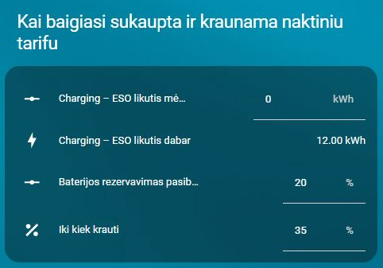
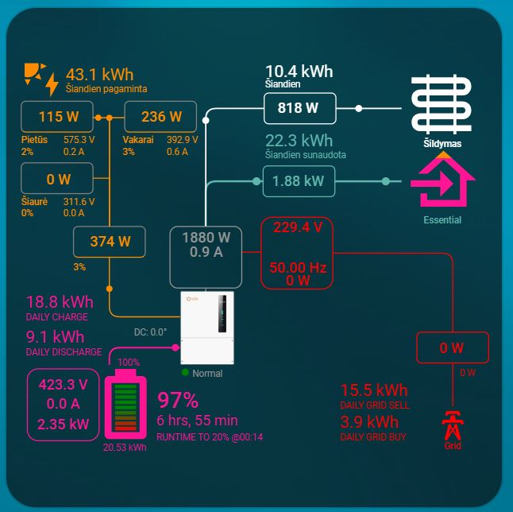

# Home Assistant – Solis baterijų krovimo automatikos ir kortelės

<a href="https://buymeacoffee.com/omenukas">
  
</a>


[Svetainė](https://omenukas.github.io/battery-charging-models-for-Solis-inverters/)

**ATNAUJINTA (2026-05-16) (Beta)**. Pridėta papildoma automatizacija baterijų iškrovimui brangiausiomis rytinėmis valandomis ir įkrovimas pigiausiomis valandomis pagal NordPool Kadangi dar BETA versija, tai aprašymai bus papildyti vėliau. Home Assistant reikia atnaujinti [03_charging_vasara_ziema.yaml](packages/03_charging_vasara_ziema.yaml) ir [Akumuliatorių krovimo nuo saulės kortelė](cards/lt/lt_generation_forecasts.yaml). Taip pat į packages direktoriją įdėti naują [04_charging_iskrovimas.yaml](packages/04_charging_iskrovimas.yaml) bei reikalinga nauja kortelė [Tinklo balansavimo kortelė](cards/lt/lt_grid_balancing_card.yaml).
Šiai versijai reikalinga Home Assistant įdiegti [NordPool](https://www.home-assistant.io/integrations/nordpool/) integraciją.

**ATNAUJINTA (2026-05-02)**. Pakeista baterijos krovimo logika vasaros režimu. Taip pat pakoreguota akumuliatorių krovimo, kai baigiasi ESO sukauptos kWh, automatizacija.
Pakoreguoti šių automatizacijų aprašymai pagal naują logiką. Home Assistant eikia atnaujinti [03_charging_vasara_ziema.yaml](packages/03_charging_vasara_ziema.yaml) ir [01_charging_eso.yaml](packages/01_charging_eso.yaml).

**ATNAUJINTA (2026-03-13)**. Visi reikalingi sensoriai ir automatizacijos sudėtos į du packages yaml failus. 
Atsisiųskite [03_charging_vasara_ziema.yaml](packages/03_charging_vasara_ziema.yaml) ir [01_charging_eso.yaml](packages/01_charging_eso.yaml), įdėkite šiuos failus į aplanką `config/packages/`.
`configuration.yaml`, jeigu dar neturite, įrašykite:
```
homeassistant:
  packages: !include_dir_named packages
```
Restartuoti Home Assistant.
Bus sukurti visi reikalingi sensoriai ir automatizacijos.

Taip pat pridėta nauja automatizacija ir kortelė, tam atvejui, kai pasibaigia žiemą sukauptos pasaugojime kilovatvalandės ir turite ESO dviejų tarifų (dieninis/naktinis) planą.

**ATNAUJINTA (2025-09-21)**. Automatizacijose tikrinama ar inverteryje įjungtas baterijų rezervavimas (Battery Reserve) ir skriptų pabaigoje grąžina į buvusią padėtį. Taip pat pakoreguota kasdieninė baterijų krovimo logika.

## Apžvalga

Šiame repozitoriume pateikiu keletą automatizacijų, kurios galėtų padėti valdyti ir prižiūrėti, kaupiklius, prijungtus prie Jūsų Solis įtampos keitiklio. Galima automatizacijas pritaikyti ir kitų gamintojų įtampos keitikliams, parenkant tinkamus sensorius, tačiau šis projektas paruoštas, naudojant [Solis modbus](https://github.com/Pho3niX90/solis_modbus) integraciją. Kadangi naudoju Waveshare modbus keitiklį, tai Solis integracijoje sensoriai turi atitinkamus pavadinimus, kuriuos automatizacijose jums gali reikėti pakoreguoti pagal savo sensorių atitinkamus pavadinimus.
Mano Solis dashboard'as atrodo taip:
 


## Struktūra
```
packages/
  ├─   # pilnas sensorių ir automatikų komplektas (YAML)
cards/
  ├─ lt/  # lietuviškos Lovelace kortelės (YAML)

```


## Automatikų paaiškinimai
**Akumuliatorių įkrovimas nuo saulės – dienos logika**
> [!IMPORTANT]
> **PASTABA:** ši automatizacija aktuali tiems, kurių saulės elektrinės momentinė generacija viršyja elektros tinklų (ESO) išduotas sąlygas, turi fiksuotus elektros tiekimo planus ir net-metering apskaitos planą. Net-billing, planų pagal biržos kainas ir norint prisidėti prie tinklų balansavimo, reikalingos kitos automatizacijos, prie kurių galimai ateityje irgi prieisiu.


Šiam scriptui reikalinga papildoma [Solcast_forecast](https://github.com/david-rapan/ha-solcast)  integracija į Home Assistant. 
Iš šios integracijos bus naudojama pora sensorių einamos dienos prognozuojamai gamybai ir maksimaliai generacijai įvertinti.
Paskirtis - įvertinti ar numatoma pakankama elektos gamyba iš saulės ir pagal tai suplanuoti, kada bus kraunamos baterijos, kad nakčiai jos būtų pilnai įkrautos.
Kaip tai veikia:
- žinodami savo dienos elektros poreikį ir baterijų talpą, galite numatyti, koks reikalingas energijos kiekis, kad dienos metu būtų patenkinami momentinio elektros suvartojimo poreikiai ir, kad įkrauti iki 100% baterijas. Ši reikšmė įrašoma kortelėje į `Reakcija į gamybos prognozę`. Jeigu prognozė yra mažesnė, nei jūsų užduota, tai inverteris visą dieną dirbs "Self use" režimu, taip suteikdamas pirmenybę baterijų įkrovimui.
- Ryte pradžioje tikrinama ar baterijos įkrautos ne mažiau 50%. Jeigu mažiau - inverteryje nustatomas "Self Use" režimas, kol baterijos įkrovos lygis pasieks 50%. Tada pradedama tikrinti prognozė, kurios duomenis atnaujina kas valandą ir pagal tai koreguoja inverterio režimą, jeigu pasikeičia prognozę lyginant su praeitos valandos. Jeigu prognozė didesnė, nei užduota, tai inverteris perjungiamas į "Feed In Priority" režimą.
- 2026-06-02 automatizacija pakeista taip, kad standartiškai baterija būtų įkraunama iki 90% (baterijų saugojimo tikslais) ir kiekvieno mėnesio 15d. aktyvuojamas baterijos krovimas iki 100%. Po trijų dienų vėl grįžtama prie 90% įkrovos režimo. Tai padaryta tam, kad kartą į mėnesį baterijų celės galėtų susikalibruoti. Todėl dienos metu iki laiko, kuris nustatytas kortelėje "Reakcija į Laiką", nesvarbu kokios prognozės ir kokiu režimu dirba inverteris, kai tik pasiekiama 90% baterijos įkrova, inverteris perjungiamas į "Feed In Priority" režimą, kad nebekrauti baterijų, o visą pagamintą energiją atiduoti į tinklus. Jeigu gamyba viršys leistiną atiduoti į tinklus, tai perviršį atiduos į baterijas.
- Atėjus laikui, nustatytam "Reakcija į laiką", patikrinama ar baterija yra pasiekusi 90% įkrovą. Jeigu įkrova mažesnė, tai inverteris perjungiamas į "Self Use" režimą, kol pasieks 90% įkrovą. Jeigu buvo pasiekta 90%, tai inverteris perjungimas į "Feed In Priority" ir daugiau nieko nekeičiama iki kitos dienos.
- Šios automatizacijos kortelėje įvestas papildomas jungiklis, kurį įjungus, visada bus kraunama iki 100%, o išjungus, bus kraunama iki 90% ir mėnesio 15 dieną trims paroms aktyvuojamas krovimas iki 100%.
- Kodėl tokia logika: Elektros tinklai nustato leidžiamą generuoti į tinklą galią, ir ją pasiekus, reikia riboti arba gamybą arba perteklių atiduoti baterijų įkrovimui. Todėl į lauką `Reakcija į max generaciją` patartina įrašyti šiek tiek mažesnę reikšmę, nei jums ESO išdavė sąlygose leistiną generuoti (dėl prognozių paklaidos) ir pradžioje baterijos nebus kraunamos, kad jeigu vis viršijama leistina gamybą, tai tą perviršį panaudos baterijų įkrovimui. 
- `Reakcija į laiką` - įrašote laiką, kada akumuliatoriai turi būti jau pilnai įkrauti. Jeigu inverteris dirbs "Feed In Priority" režimu, tai bus perjungtas į "Self use", kad pilnai įkrauti baterijas, jei iki to laiko dar nebuvo tai padaryta.
 Padariau rankinį laiko pasirinkimą, nes nesugalvojau, kaip tą galima būtų automatizuoti, įvertinant metų laikus (kada pradeda saulė leisti), kitus galimus faktorius.

> [!IMPORTANT]
> **PASTABA:**
> - Šis skriptas nuo 06:00 iki laiko, užduoto "Reakcija į laiką", kas 60 minučių tikrina Solarcast prognozes ir pagal tai, jeigu reikia, pakoreguoja scenarijaus veikimo principą;
> - Ryte, nepriklausomai nuo prognozės visada pirmiau leidžia baterijai įsikrauti iki 50%;


Atsisiųsti kortelę - [Akumuliatorių krovimo nuo saulės kortelė](cards/lt/lt_generation_forecasts.yaml) 


**Elektros planiniai atjungimai (ESO planiniai darbai)**


Bent jau mano praktikoje, kai elektros tinklai numato elektros atjungimus, tai jie beveik visada būna nuo ryto, kai akumuliatoriai būna išsikrovę po nakties, bet saulės elektrinė dar tik pradeda gamybą. Todėl, gavus iš elektros tinklų pranešimą apie numatomą elektros atjungimą, galima iš anksto pasirūpinti, kad tą dieną, kai bus atjungiama elektra, akumuliatoriai būtų pilnai įkrauti. 
Tam reikalinga papildoma lokalaus Home Assistant kalendoriaus integracija. Reikia sukurti naują kalendorių `calendar.eso_planiniai_darbai`:
Home Assistant->Settings->Devices&Services->+Add integration->per paiešką surandame ir pasirenkame "Local calendar"->atsidariusioje lentelėje "Calendar name" įrašome **BŪTINAI** `eso planiniai darbai`ir pažymime "Create an empty calendar"->spaudžiame "Submit" ir "Finnish". Susikūrė naujas kalendorius į kurį bus registruojami elektros tinklų planiniai darbai. Dar kartą pasitikrinkite ar tikrai susikūrė kalendorius, kurio entity `calendar.eso_planiniai_darbai`.
Kaip tai veikia:
   - Gavus pranešimą iš elektros tinklų, į "ESO planiniai darbai" kortelę įrašome darbu pradžios ir pabaigos datą ir laiką. Paspaudus mygtuką "Sukurti ESO įvykį", kalendoriuje tai dienai sukuriamas įvykis.
   - Automatizacija, vidurnaktį aptikusi, kad tą dieną numatomas elektros atjungimas, pradeda vykdyti tokį scenarijų:
   - inverteryje įjungia `switch.grid_time_of_use_charging_period_1`- įjungia priverstinį baterijų krovimą iš tinklo. Šį TOU inverteryje reikėtų turėti iš anksto pasiruoštą. Jeigu jis jau naudojamas kitur, tai pasirinkti kitą laisvą ir nepamiršti padaryti pataisymus automatizacijose. Kadangi pas mane baterijos aukštos įtampos, tai mano nustatymai tokie:
     Charge Time Slot 1 - 00:00-06:00;
     Charge Current 1 - 20A
     SOC1 - 100%
     Šiuos nustatymus galima padaryti tiek SolisCloud programėlėje, tiek HA Solis modbus integracijoje.
   - įjungia `input_boolean.akumuliatoriu_rankinis_rezervavimas`- Home Assistant virtualus jungiklis, kurį sukūrėte Helper dalyje. Reikalinga, kad atjungti kitas galbūt tuo metu naudojamas automatizacijas.
   - inverteryje įjungia `switch.reserve_battery_mode`, jeigu jis nebuvo įjungtas. Prieš tai įsimenama jo būsena.
   - įsimena esamą `number.solis_waveshare_backup_soc`- įsimena, koks inverteryje šiuo metu nustatytas baterijų backup rezervavimas, kad vėliau žinotų kokias reikšmes atstatyti
   - `number.solis_waveshare_backup_soc` reikšmę nustato į "100" - nustato baterijų rezervavimą į "100%", kad neleistų akumuliatoriams išsikraudinėti, kol nedingo elektros tiekimas iš tinklų;
   - Prasideda baterijų krovimas iš tinklo. Pasiekus akumuliatorių 100% įkrovą, išjungiamas inverteryje `switch.grid_time_of_use_charging_period_1`, tačiau baterijos rezervavimas lieka įjungtas ir rezervas nustatytas 100%. Tokiu būdu ryte akumuliatoriai bus pilnai įkrauti, o automatizacija lauks kol dings įtampa bent vienoje į įvadinių fazių arba ateis laikas, kuris kalendoriuje pažymėtas, kaip darbų pabaiga. Išpildžius bent vieną iš sąlygų, automatizacija grąžins visus inverterio nustatymus į pradinę būseną, Home Assistant vėl pradės veikti "Žiemos režimas" (aprašytas žemiau), jei jis buvo įjungtas.

Atsisiųsti kortelę - [ESO planiniai darbai kortelė](cards/lt/lt_grid_planned_outages.yaml) 

**Žiemos režimas**  


Žiemą, kai nėra elektros gamybos iš saulės, veikia šilumos siurbliai, akumuliatoriai tampa beveik nereikalingi. Tačiau jie vis dar gali atlikti savo pagrindinę funkciją - užtikrinti elektros tiekimą į namus, kai dingsta elektros tiekimas iš tinklų.
Ką daro ši automatizacija:
   - Kortelėje įjungus `Žiemos režimas`, įjungiamas inverteryje baterijų backup rezervavimas ir "Self use" režimas (jeigu dar nebuvo įjungti) ir nustatomas rezervo SOC toks, kokia reikšmė yra jūsų pačių pasirinkta laukelyje `Rezervas žiemai`. Tai reiškia, kad žiemos režimo metu ir kol yra elektros tiekimas iš tinklų, jūsų inverterio akumuliatoriai niekada neišsikraus žemiau užduotos ribos.
   - Išjungus žiemos režimą, bus atsatytas baterijų rezervavimas į būseną, kuri buvo prieš žiemos režimą, ir baterijų backup rezervas nustatomas į tokią reikšmę, kokia reikšmė yra jūsų pačių pasirinkta laukelyje `Rezervas vasarai`. 
   - Ši automatizacija turi dar vieną saugiklį - jos vykdymas nutraukiamas, jeigu įjungiamas `input_boolean.akumuliatoriu_rankinis_rezervavimas`. Šį jungiklį junginėja kitos su akumuliatorių krovimu susijusios automatizacijos, kad įgautų prioritetą.

Atsisiųsti kortelę - [Žiemos režimo kortelė](cards/lt/lt_winter_mode_reserves.yaml) 


**Akumuliatorių profilaktinis įkrovimas**


Kadangi žiemą akumuliatoriai nuo saulės turi mažai šansų įsikrauti iki 100% ir ilgesniam laiko periodui tai turi įtaką pačių baterijų degradacijai, tai ši automatizacija pasirūpina, kad kartais baterijos būtų pilnai ikraunamos.
Ši automatizacija veikia tik tada, kai yra įjungtas "Žiemos režimas" 
Kortelėje galite nustatyti profilaktinio įkrovimo periodiškumą ir laiką, kada prasidės priverstinis krovimas iš tinklo.
Ši automatizacija inverteryje įjungia `switch.grid_time_of_use_charging_period_2`- priverstinį baterijų krovimą iš tinklo. Šį TOU inverteryje reikėtų turėti iš anksto pasiruoštą. Jeigu jis jau naudojamas kitur, tai pasirinkti kitą laisvą ir nepamiršti padaryti pataisymus automatizacijose.
Mano inverteryje nustatyta taip:
     Charge Time Slot 2 - 00:00-00:00;
     Charge Current 2 - 20A
     SOC2 - 100%

Atsisiųsti kortelę - [Akumuliatorių profilaktinio krovimo kortelė](cards/lt/lt_preventive_battery_charging.yaml) 


**Akumuliatorių įkrovimas, kai baigiasi ESO pasaugoti atiduotos kWh**



Kiekvieno mėnesio pradžioje kortelėje ranka įrašome (2026-05-02 automatizacija pakoreguota, kad prasidėjus naujam mėnesiui, automatiškai įrašomas likutis, o gavus duomenis iš ESO, visada galima ranka pakoreguoti dėl galimos paklaidos) koks yra sukauptos elektros likutis iš ESO savitarnos. Scriptas seka kiek atiduodama į tinklą ir kiek paimama iš tinklo. Kai ESO pasaugojime likutis tampa neigiamas, išjungiamas žiemos režimas ir pradedamas vykdyti akumuliatorių krovimo scenarijus. Kortelėje nustatote baterijos rezervą ir iki kiek naktį įkrauti akumuliatorių. Krovimą pradeda vidurnaktį ir pilnai įkrovus laiko tokią įkrovą, kol prasideda dieninis tarifas. Prasidėjus dieniniam tarifui, akumuliatoriams leidžiama išsikrauti iki pasirinktos baterijos rezervavimo reikšmės. Kai ESO balansas tampa vėl teigiamas, scriptas nebeveikia ir naktimis nebekrauna akumuliatorių. Svarbu, kad į žieminį režimą jau nebegrįžtama (tiesiog tikėtina, kad teigiamas balansas bus jau pavasarį). Žiemą iki kiek krauti visada laikau 100%, bet pavasarį, kai jau šviečia saulė, mažinu įkrovimą ir leidžiu įkrauti tik tiek, kad užtektų nuo dieninio tarifo pradžios iki kol užteks namui gamybos nuo saulės.

Atsisiųsti kortelę - [Akumuliatorių krovimas kai baigiasi ESO](cards/lt/lt_eso_balance_ended.yaml) 

**Saulės elektrinės kortelė**



Kortelė sukurta naudojant integraciją [sunsynk-power-flow-card](https://github.com/slipx06/sunsynk-power-flow-card).

Mano naudojamą kortelę atsisiųsti - [Saulės elektrinės kortelė](cards/lt/lt_solar_inverter_card.yaml) 

## Pabaigai
Visi reikalingi helper sensoriai yra sukuriami packages failuose, tačiau inverterio, apskaitos Solcast sensorius turite būtinai parinkti pagal savo turimus.


Jeigu patiko mano darbas, visada galite tai įvertinti 

<a href="https://buymeacoffee.com/omenukas">
  
</a>

<div align="center">
  <a href="https://github.com/omenukas/battery-charging-models-for-Solis-inverters">
    
  </a>
  &nbsp;
  <a href="https://github.com/omenukas/battery-charging-models-for-Solis-inverters/archive/refs/heads/main.zip">
    
  </a>
</div>

<p align="center">
  <a href="https://github.com/omenukas/battery-charging-models-for-Solis-inverters/blob/main/README.md"
     style="display:inline-block;padding:10px 16px;border:1px solid #0366d6;border-radius:6px;text-decoration:none;">
    Eiti į GitHub repo →
  </a>
</p>
